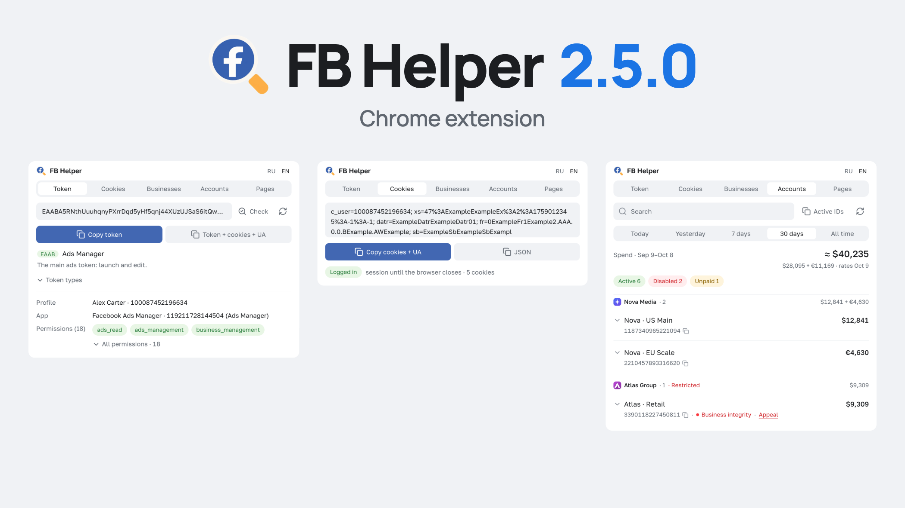

# FB Helper 2.4.1

[](https://github.com/slilbudget/fb-helper/actions/workflows/ci.yml) [](https://github.com/slilbudget/fb-helper/releases/latest) [](LICENSE)



Chrome extension (MV3): Facebook access token, session cookies, and the spend and problems of your ad accounts, businesses and Pages in one popup, each problem with a link to the Facebook page that fixes it. Read-only — it never changes anything in your ads.

## Install

1. Download `fb-helper-2.4.1.zip` from [Releases](https://github.com/slilbudget/fb-helper/releases/latest) and unpack (or `git clone` and use the `fb-helper/` folder)
2. `chrome://extensions` → enable **Developer mode**
3. **Load unpacked** → pick the unpacked folder (from a clone: `fb-helper/`; keep the folder after installing)

Chrome 121+. A Facebook tab must be open in the same profile; the ads token (EAAB) comes from `adsmanager.facebook.com`.

## Features

Five tabs, in this order: **Token · Cookies · Businesses · Accounts · Pages**. The three list tabs share one row: picture, name, one number, and on the second line a problem with its fix link; a healthy row says nothing, a click opens the details.

- **Language** — English and Russian, `RU · EN` toggle in the header. The first run follows the browser's UI language; after that the choice is yours, stored in `chrome.storage.local`, and survives a browser restart.
- **Token** — reads the token from the open FB tab and shows its type: EAAB (Ads Manager), EAAG (Business Manager), EAAd (Events Manager), EAAH (Commerce Manager), EAAI (Automated Rules). Each type links to the page where that token lives. **Check** shows the profile, the app and the permissions behind the token. The refresh button next to the field re-reads the token from the FB tab (and lets you retry a token that was reported dead).
- **Cookies** — **Copy cookies + UA** (cookie string, blank line, the profile's User-Agent; no Graph request) or JSON with attributes for importing into a browser profile; **Token + cookies + UA** (Token tab) copies them in one block — token, blank line, cookie string, blank line, User-Agent, blank line, then `Profile: <name> (<id>)` and `BM: <name> (<id>), …` in English — after one `/me` read confirms the token belongs to the logged-in user (`c_user`) and brings the profile name and its Business Managers (`BM: not available` for tokens without `business_management`, e.g. EAAd / EAAH). A token from another account is not copied, and neither is a block without a readable User-Agent. The User-Agent is not shown in the popup; it is read, when a copy button needs it, from the open Facebook tab, so it is the one the page sees (which can differ from the popup's own value).
- **Businesses** — what you have and how much each business spends. One row per business of the profile (and per business an ad account names): logo, name, ID and the spend for the selected period (Today / Yesterday / 7 days / 30 days / All time, the same switch as on the Accounts tab), with the total of all businesses on top (personal ad accounts are not in it). Under the name: how many ad accounts it has, `3 ad accounts · 1 disabled`. A problem comes with its fix: a failed, rejected, revoked or expired business verification → *Verify*; ad accounts but none active → *Manage ad accounts*; no ad accounts → *Create account*. A click opens the row: the counts, the exact verification state, what to do, a link to Business Settings and *Show ad accounts*, which opens the Accounts tab filtered to that business. Role, created date, primary page and 2FA are not shown. Spend and counts come from the Accounts list, so the refresh button refreshes both; the business list itself is one paged read of `me/businesses` (ID, name, verification state, logo).
- **Accounts** — which ad account works, what it spends, what is broken and how to fix it. Grouped by business (a sticky header with the business's subtotal for the period; personal accounts last). A row: name and the period's spend in the account's currency; a healthy account says nothing, a problem is one word (the status or the disable reason: *Ads policy*, *Unpaid*, *In review*, *Restricted*, …) with its fix link (*Appeal*, *Pay*, *Secure*, *Support*, *Request review*) and *+N more* when there are further steps. The open row shows the numbers (clicks and CPC for the period, total spent, amount to pay, billing threshold, daily limit, spend cap, payment method, pixels, time zone, country, created date), what to do, links to Ads Manager and Billing, and the account's ads: statuses, rejection reasons (every reason with the placement it applies to; disapproved ads first) and, for the selected period, each ad's spend, impressions, clicks and CPC (a second read after the ads list; switching the period sends nothing; "All time" is Meta's `maximum`, at most 37 months). An account's own "All time" is the larger of Meta's total, which lags behind, and the last 30 days + today. Search, status chips, a business filter (set from the Businesses tab) and **Active IDs** (copies the IDs of the active accounts assigned to you). The list also holds the ad accounts that each business of the profile owns or is a client of, merged without duplicates; an account you are not assigned to is marked *No access* with an *Assign me* link to that business's ad-account settings. The refresh button re-reads the list only; each account's ads have their own refresh icon, so the ads cost nothing unless you ask. The loaded list and ads are kept until the browser closes and survive FB tab or token changes; logging in as another FB user drops them.
- **Pages** — is each Page ready to run ads. Every Page the token can see: the profile's own (`me/accounts`, which carries your tasks) plus the `owned_pages` and `client_pages` of each business, merged by ID, each with its picture. A ready Page says nothing; a problem has one fix link: *No access* (no Advertise task for you, or the Page is visible only through a business) → *Assign me*; *Unpublished* → *Publish* (Business Suite); *Can't advertise* (Graph says it cannot be promoted) → *Appeal* (Account Quality); *No Instagram* (no account and no “Use Facebook Page”) → *Set “Use Facebook Page”* (Ads Manager). Problem chips filter the list; search by name, ID or business. The open row lists every problem with its fix, the Instagram state (account, page identity, none, unknown), the owner business, your access, and links to the Page, Business Suite and the business's Pages settings. Followers and category are not shown. Read-only GETs with an explicit field list; Page access tokens are never requested or stored.
- **Next steps** — a problem on a list tab, and a rejected ad, each get one link to the Facebook page where you act on it (Account Quality for an appeal or a review request, Billing, the hacked-profile page, support, Business Settings, Business Suite, Ads Manager) and a plain line on what it means. Links only: each opens a Facebook page in a new tab and the extension changes nothing. Of these URLs only the Ads Manager one has been click-tested so far; `fb-helper/js/links.js` marks which.
- **Money** — a row shows its spend exactly, in its own currency (two currencies: `$75.00 + €20.00`; three or more: `≈ $`, the breakdown in the tooltip). A total over two or more currencies is `≈ $1,727`, converted at the daily rate, with the breakdown and the rate date under it; the provider's attribution (*Rates By Exchange Rate API*) is shown when its table is used. Lists are ordered by spend (by USD value when rates are known). Without rates (offline, both sources down) a total stays a per-currency sum. The one request this needs is described under *Where it connects*.

## Safety and limits

### Where it connects

The exact origins are the `connect-src` and `img-src` of `fb-helper/manifest.json`; `DOCS_STRICT=1 node --test test/docs.test.mjs` fails when the privacy policy (English or Russian) misses one of them or the store listing's CSP quote differs from the manifest's. Nothing else is contacted: no developer server, no analytics, no telemetry.

| Destination | What goes there | When |
|---|---|---|
| `graph.facebook.com` — Meta's Graph API | `GET` reads with the token in an `Authorization` header; the browser attaches your Facebook cookies, as on facebook.com. The code has no other method and no request body, and a path is built from word segments only (an ID from Graph never adds `/`, `?` or `..`). | On a button press; when the **Businesses**, **Accounts** or **Pages** tab opens with nothing loaded; on the **Accounts** tab also after you reloaded the Facebook page the token came from, if its list is older than 10 minutes. Reopening the popup or switching tabs sends nothing. After a list has loaded, the rows that got no picture URL from it are asked about in one more light read (`GET /<version>/?ids=…` with up to 50 digit-only IDs, asking for the picture field and nothing else; at most 4 such reads per refresh); it is silent when it fails. |
| `fbcdn.net`, `fbsbx.com` — Meta's image CDN | The pictures of businesses and Pages. The URL comes from the Graph read (the list or the picture read above) and is used only if it is https on one of these two hosts; no referrer. A Page that has no URL at all is shown through `graph.facebook.com/<version>/<Page ID>/picture?type=small`, which redirects to the picture (no token in it; this origin is in `img-src` for that, and imageUrl accepts exactly that path). | For rows the popup draws (24 px, loaded at once, not lazily). Meta sees the picture requests and your IP address. |
| `open.er-api.com`, fallback `cdn.jsdelivr.net` — exchange rates | One public rate file, the same for everybody: no cookies, no referrer, nothing about you or your accounts. | At most once a day (cached in `chrome.storage.local`), and only while the Businesses or Accounts tab shows spend in two or more currencies. A failed attempt is not repeated for 20 minutes. The service sees your IP address. |

The links in the popup open Facebook pages in a new tab and send nothing; the one other link is the exchange-rate provider's attribution next to a converted total, which opens when you click it.

### Data and storage

- The token is shown only while an open Facebook tab has it. Cookies and the User-Agent are read live (the User-Agent when a copy button needs it) and never stored. Page access tokens are never requested or stored: the field lists are explicit and every row is cut to a whitelist.
- `chrome.storage.session` (memory; gone when the browser closes or the extension is reloaded): `token` and the tab it came from, `owner` (the Facebook user ID the lists belong to; logging in as another user drops them), the loaded lists `accounts` with `ads` and `view` (which rows are open), `bms` and `pages`, `dead` (tokens Meta called dead), `checked` (the owner check of the token), `locks` (rate slots), `usage`, `cooldownUntil` and `budget`.
- `chrome.storage.local`: `lang`, `apiVersion`, `fx` (the exchange-rate table and its date) and `fxFail` (when the last rate download failed). The popup's `localStorage`: `tab` and `period`.

### Limits

- One refresh per minute per list: Businesses, Accounts and Pages each have their own slot, shared by every open popup window, and a failed attempt counts. An Accounts or Pages refresh is one sequential pass: the profile's own list, then `me/businesses`, then two edges of each business (at most 50 businesses; ad-account edges up to 3 pages of 50, Pages up to 4 pages of 50 per edge), about 100 edge reads for 50 businesses. The Businesses refresh also refreshes the Accounts list. One account's ads: one read per 30 s (two requests: the ads, then their numbers).
- At most 600 requests per hour in total, counted in `chrome.storage.session`: a soft guard against a runaway loop; past it the extension waits until there is room.
- A rate-limit answer from Meta (codes 4, 17, 32, 613, 80000–80999 or HTTP 429), or Meta's own usage figure reaching 95 %, pauses every request for 30 min.
- A dead session (error 190 or 102) stops requests with that token until Facebook hands out a new one or you press the refresh button next to the token. Automatic loads are skipped during a pause and with a dead session; open Facebook tabs are read in parallel, so a frozen or busy tab doesn't hold the popup.
- Graph API version: `v26.0`. When Meta retires it, the extension switches to the newer version Graph names.

## Layout

| Folder | What it is |
|---|---|
| `fb-helper/` | The extension (FB Helper): `manifest.json`, `popup.html`, `css`, `js`, `fonts`, `images` |
| `chrome-web-store/` | The Chrome Web Store version (Ads Helper: other name and logo): build script, listing texts, checklist, artwork |
| `test/` | Unit and end-to-end tests |
| `docs/` | Images for this README |

## Build the archive

```
git archive --format=zip -o fb-helper-2.4.1.zip HEAD:fb-helper && zip -qj fb-helper-2.4.1.zip LICENSE
```

Only committed files go in: anything else lying in the local `fb-helper/` folder stays out.

The Chrome Web Store package (`chrome-web-store/release/ads-helper-<version>.zip`) comes from `chrome-web-store/build.sh`.

## Tests

```
node --test test/*.test.mjs   # unit tests, no browser, no install
DOCS_STRICT=1 node --test test/docs.test.mjs   # release check: the docs name every origin the manifest's CSP allows and quote that CSP
npm ci && npx playwright-core install chromium    # once: the dev tooling (playwright-core, pinned); nothing of it ships
node test/e2e.mjs             # real Chromium + the unpacked extension, Facebook and Graph mocked
node test/e2e.mjs --jobs 3    # the same, three flows at a time; --shard 2/4 runs one balanced slice (CI uses 4 shards)
```

`EXT_DIR=chrome-web-store/release/unpacked node test/e2e.mjs` runs the same flows against the store build.

Icons: Lucide (ISC). Font: Golos Text (SIL OFL 1.1). Licenses sit next to the files.

[MIT](LICENSE) · [Security](SECURITY.md) · [Contributing](CONTRIBUTING.md)
